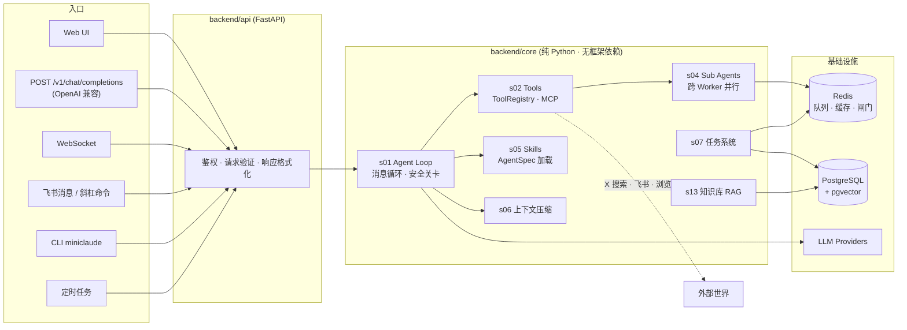

<div align="center">

# 🧠 NeuralHub

**AI Agent 平台 —— 会话、工具、技能、知识库、舆情雷达，一套容器跑起来**


多模型 · 多入口 · 多 Agent 并行 · MCP 协议 · RAG 知识库 · 事件情报 · X 舆情监控


</div>

---

## ✨ 它能干什么

| 能力 | 说明 |
| --- | --- |
| 🤖 **Agent 引擎** | 完整消息循环：工具调用、安全关卡（HMAC）、上下文压缩，多轮长任务不断片 |
| 🔌 **多模型接入** | Anthropic / OpenAI / Ollama / 任意 OpenAI 兼容接口，运行时热切换 Provider |
| 🧰 **工具系统** | `ToolRegistry` 统一注册，内置浏览器、X 搜索、飞书推送等；支持 **MCP 协议**外接工具 |
| 🎭 **Skills / AgentSpec** | `skills/` 目录即插即用：AI 早报、代码审查、面试训练、金融查询… |
| 🧑‍🤝‍🧑 **多 Agent 并行** | `spawn_agent` 经 Redis 队列分发到多 Worker，失败回传、超时回收、进度实时推 WS |
| ⏰ **任务系统** | 定时任务绑定 spec 自动执行（如每日 AI 早报），分布式锁防重复触发 |
| 📚 **知识库 RAG** | pgvector 向量检索、多库硬隔离、文档幂等入库，Agent 可引用检索结果 |
| 🪝 **事件钩子** | 订阅关键词 → LLM 提炼事件情报 → 飞书卡片推送，前端玻璃拟态管理页 |
| 📡 **X 舆情雷达** | REST API 四件套：关键词搜索 / 热度排行对比 / 阈值监控告警 / 舆情沉淀入库 |
| 📊 **可观测性** | 结构化日志（trace_id 贯穿）、Prometheus 指标、前端 Logs / Metrics 页面 |

> 实况口径：**66 个 HTTP 端点**，核心引擎 7 个子系统落地（`s01/s02/s04/s05/s06/s07/s13`，共 ~32k 行），另有 6 个规划位预留。

## 🗺️ 系统鸟瞰



架构铁律：`backend/core/` 不依赖 FastAPI、不直接调 LLM（经注入的 adapter）；每个子系统只通过 `__init__.py` 暴露接口；单文件 ≤ 200 行。

## 🚪 入口一览

| 入口 | 说明 |
| --- | --- |
| Web UI | 8 个页面：仪表板 / 会话 / 团队 / 钩子 / 知识库 / 设置 / 日志 / 指标 |
| `POST /v1/chat/completions` | OpenAI 兼容接口，支持流式返回，可直接对接任意 OpenAI 客户端 |
| WebSocket | 实时消息、tool call、sub-agent 进度事件 |
| CLI `miniclaude` | REPL 交互 + `miniclaude run <spec_id>` 一次性执行 |
| 飞书 | 普通消息走主 agent，`/spec_id` 斜杠命令直达 skill |
| 定时任务 | 绑定 `spec_id` 按计划自动执行（AI 早报、面试日报都在跑） |

## 📡 X 舆情雷达（REST API）

对 X/Twitter 舆情的完整闭环：**搜 → 比 → 盯 → 存**。全部躲在功能开关后（`X_API_ENABLED` / `X_MONITOR_ENABLED`），带全局频控闸门（5s 最小间隔 + 每日额度），额度打满只影响新接口、不伤存量功能。

```bash
TOKEN="$AUTH_SECRET"

# ① 搜：最近 7 天关键词推文，按热度排序（赞×1 + 转×2 + 浏览×0.01）
curl -s "http://127.0.0.1:8000/api/x/searches?q=Claude+Code&sort=engagement" \
  -H "Authorization: Bearer $TOKEN"

# ② 比：最多 4 个词同场对比声量，谁火一目了然
curl -s "http://127.0.0.1:8000/api/x/compare?q=claude,gpt,gemini" \
  -H "Authorization: Bearer $TOKEN"

# ③ 盯：建监控，出现 50 赞以上的推文自动发飞书卡片（同推文只报一次）
curl -s -X POST "http://127.0.0.1:8000/api/x/monitors" \
  -H "Authorization: Bearer $TOKEN" -H "Content-Type: application/json" \
  -d '{"query": "Claude Code", "interval_minutes": 60, "search_type": "Top", "threshold_likes": 50}'

# ④ 存：舆情快照写入指定知识库（幂等覆盖，绝不写错库），供 Agent 检索引用
curl -s -X POST "http://127.0.0.1:8000/api/x/exports" \
  -H "Authorization: Bearer $TOKEN" -H "Content-Type: application/json" \
  -d '{"query": "Claude Code", "kb_id": "<你的专库id>"}'
```

## 🪝 事件钩子

给关键词装上"耳朵"：命中新事件后由 LLM 提炼相关性与要点（强去噪），生成情报卡片推送飞书，历史可在前端 Hooks 页回看。与 X 监控的分工——**钩子做事件情报，监控做单推文阈值告警**。

## 🚀 快速开始

### Docker Compose（推荐）

```bash
cp .env.example .env   # 至少配置 DATABASE_URL / REDIS_URL / AUTH_SECRET / 一个 provider key
docker compose up -d --build
curl http://127.0.0.1:8000/health/ready
```

完整部署与运维（含 Loki 日志、Prometheus 观测栈）见 [DEPLOY.md](DEPLOY.md)。

<details>
<summary>本地开发（后端热重载 + 前端 dev server）</summary>

```bash
python -m venv venv && source venv/bin/activate
pip install -r backend/requirements.txt -r backend/requirements-dev.txt
cd frontend && npm install && cd ..

make dev            # 后端 :8000（等价 uvicorn backend.main:app --reload）
make dev-frontend   # 前端 dev server
```

</details>

## 🔌 OpenAI 兼容 API

任何支持 OpenAI 协议的客户端都能直连：

```bash
curl http://127.0.0.1:8000/v1/chat/completions \
  -H "Content-Type: application/json" \
  -H "Authorization: Bearer $AUTH_SECRET" \
  -d '{
    "model": "claude-sonnet-5",
    "provider_id": "anthropic",
    "messages": [{"role": "user", "content": "读一下 backend/core/s07_task_system/scheduler.py"}],
    "stream": true
  }'
```

## 📁 目录结构

```text
backend/
  api/        FastAPI 入口层：路由、鉴权、WS、飞书回调
  core/       纯 Python 引擎
    s01_agent_loop/           消息循环 · 安全关卡 · 规划
    s02_tools/                工具注册 · 内置工具 · MCP 桥接
    s04_sub_agents/           跨 Worker 子 agent
    s05_skills/               AgentSpec / Skills 加载
    s06_context_compression/  上下文压缩
    s07_task_system/          定时任务 · 调度 · 分布式锁
    s13_knowledge/            知识库 RAG（pgvector）
    (s03/s08–s12 为规划预留位)
  storage/    SQLAlchemy 模型 + Store 层（alembic 迁移 ×8）
  adapters/   LLM Provider 适配器
frontend/     React + Vite + TS（玻璃拟态 UI）
skills/       skill 定义：daily-ai-news · code-reviewer · interview-daily · lingxi-* …
extension/    浏览器 Cookie 同步扩展
```

## 🧪 质量

- 单元测试 **1464 passed / 0 failed**（pytest + pytest-asyncio，外部 API 全 mock）
- 每个公开接口至少一个用例；真库测试走 Testcontainers（PostgreSQL + pgvector）
- 结构化日志贯穿 `trace_id` / `session_id` / `worker_id`，排障路径见 [DEPLOY.md](DEPLOY.md)

## 📚 相关文档

| 文档 | 内容 |
| --- | --- |
| [PROJECT_OVERVIEW.md](PROJECT_OVERVIEW.md) | 全模块梳理 |
| [DEPLOY.md](DEPLOY.md) | 部署、观测、排障 |
| [tasks/ARCHITECTURE.md](tasks/ARCHITECTURE.md) | 架构文档 |
| [AGENTS.md](AGENTS.md) | 仓库内 agent 协作约束 |
