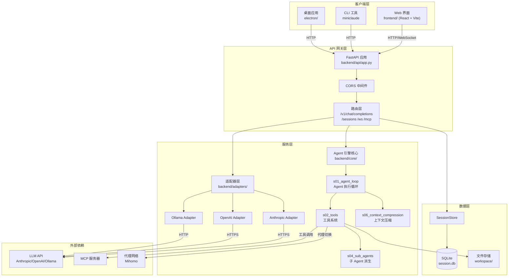
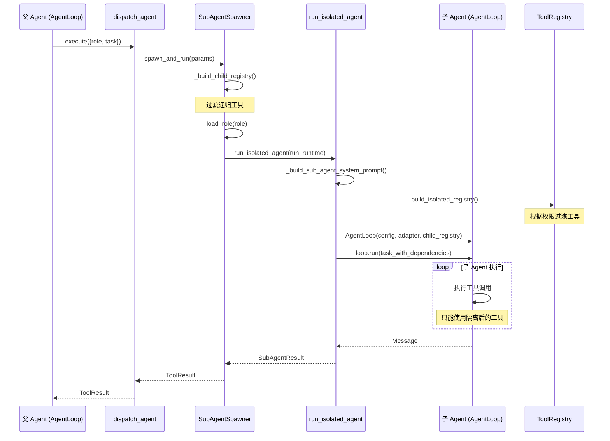
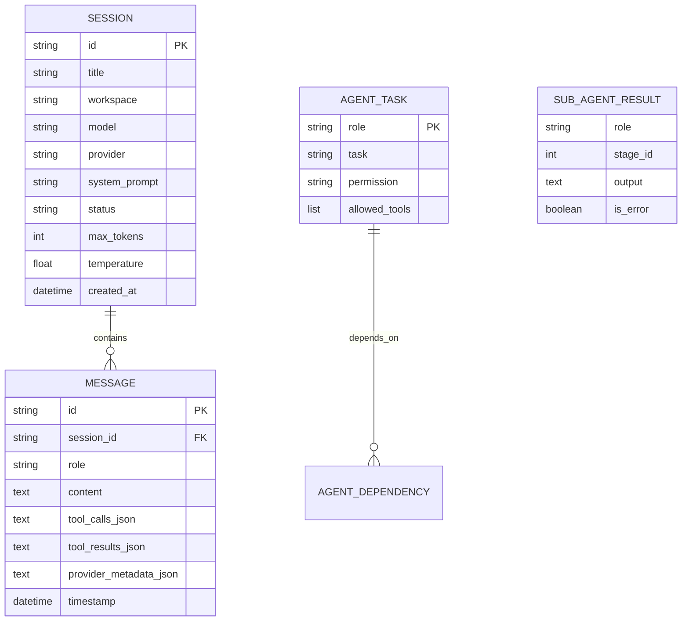
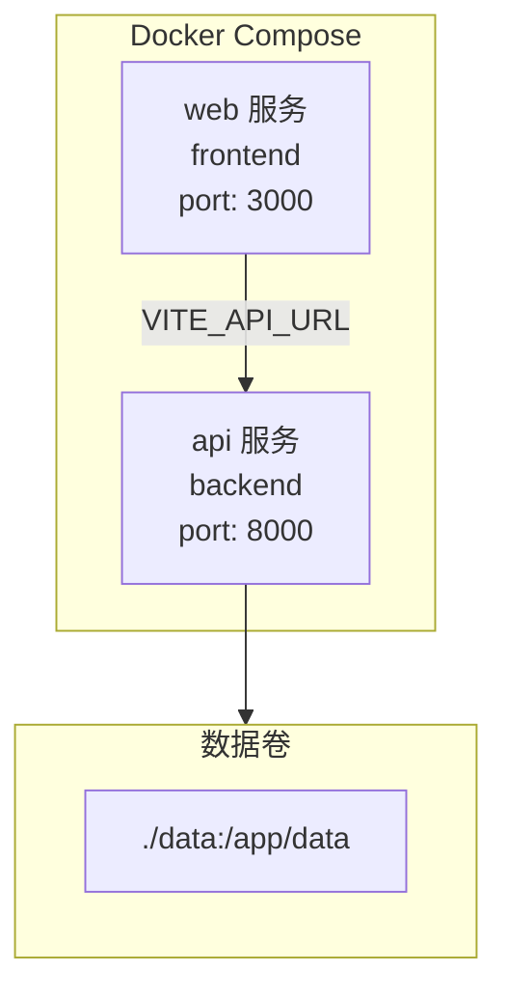
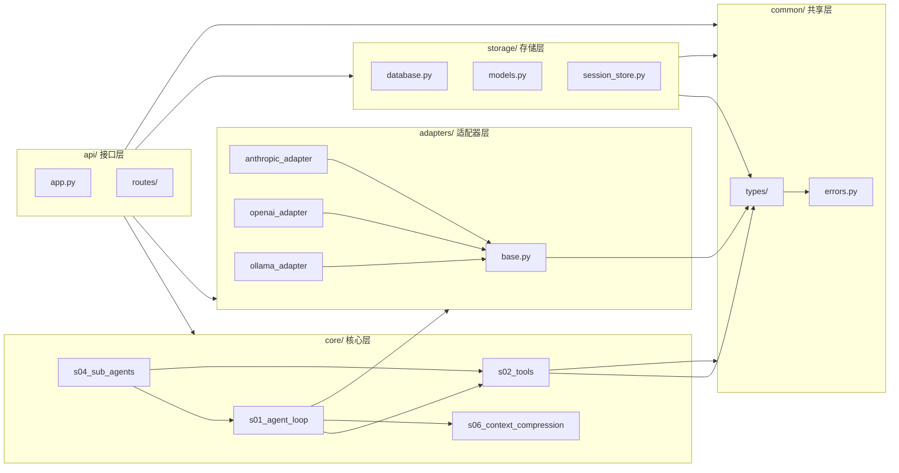

# NeuralHub 架构文档

## 1. 项目概览

### 1.1 项目简介

**NeuralHub** 是一个自建 AI Coding Agent 平台，提供 Web 界面、OpenAI 兼容 API 和完整的 Agent 引擎。支持多 LLM 提供商、工具调用、子 Agent 派生、任务编排等高级功能。

### 1.2 核心功能

- **多 LLM 支持**: Anthropic Claude、OpenAI GPT、Ollama 本地模型
- **OpenAI 兼容 API**: `/v1/chat/completions` 接口，支持流式响应
- **Agent 引擎**: 完整的 Agent Loop、工具调用、子 Agent 派生与编排
- **实时通信**: WebSocket 实时消息流
- **会话管理**: 持久化会话历史、多工作区支持
- **代理网络**: 集成 Mihomo 代理管理，支持链式代理

### 1.3 技术栈

| 层级 | 技术 |
|------|------|
| **后端** | Python 3.12+, FastAPI, Pydantic v2, SQLAlchemy, httpx |
| **前端** | React 19, Vite, TypeScript, Tailwind CSS, Zustand |
| **数据库** | SQLite (开发) / PostgreSQL (生产) |
| **通信** | HTTP/REST, WebSocket, Server-Sent Events |
| **部署** | Docker, Docker Compose, Kubernetes (配置) |

### 1.4 项目目录结构

```
agent-studio/
├── agents/                     # Agent 角色定义
│   ├── builtin/               # 内置角色 (reviewer, verifier 等)
│   ├── custom/                # 自定义角色
│   └── examples/              # 示例角色
├── backend/                    # Python 后端
│   ├── adapters/              # LLM 适配器层
│   ├── api/                   # FastAPI 应用和路由
│   ├── cli_support/           # CLI 支持模块
│   ├── common/                # 共享类型和工具
│   ├── config/                # 配置管理
│   ├── core/                  # 核心 Agent 引擎 (s01-s12)
│   ├── schemas/               # Pydantic 模型
│   ├── storage/               # 数据持久化层
│   └── tests/                 # 单元测试
├── config/                     # 运行时配置
├── deploy/                     # 部署配置
│   ├── docker/                # Docker 配置
│   ├── k8s/                   # Kubernetes 配置
│   └── scripts/               # 部署脚本
├── docs/                       # 文档
├── electron/                   # Electron 桌面应用
├── frontend/                   # React 前端
│   ├── src/
│   │   ├── components/        # UI 组件
│   │   ├── hooks/             # React Hooks
│   │   ├── lib/               # 工具库
│   │   ├── pages/             # 页面组件
│   │   ├── stores/            # Zustand 状态管理
│   │   └── types/             # TypeScript 类型
│   └── package.json
├── skills/                     # Agent 技能定义
├── docker-compose.yml          # 本地开发部署
├── pyproject.toml             # Python 项目配置
└── README.md
```

---

## 2. 系统架构总览图



---

## 3. 模块详解

### 3.1 适配器层 (backend/adapters/)

**职责**: 统一不同 LLM 提供商的接口差异，提供标准适配器接口。

**关键文件**:
| 文件 | 作用 |
|------|------|
| `base.py` | 定义 `LLMAdapter` 抽象基类，统一 `complete()` 和 `stream()` 接口 |
| `anthropic_adapter.py` | Anthropic Claude API 适配，支持 function calling |
| `openai_adapter.py` | OpenAI GPT API 适配 |
| `ollama_adapter.py` | Ollama 本地模型适配 |
| `factory.py` | 适配器工厂，根据配置创建对应适配器 |
| `provider_manager.py` | 提供商管理，支持动态切换模型 |

**对外接口**:
```python
class LLMAdapter(ABC):
    @abstractmethod
    async def complete(self, request: LLMRequest) -> LLMResponse
    
    @abstractmethod
    def stream(self, request: LLMRequest) -> AsyncIterator[StreamChunk]
```

**依赖关系**:
- 依赖: `backend/common/types/llm.py` (LLMRequest, LLMResponse)
- 被依赖: `backend/api/routes/chat_completions.py`, `backend/core/s01_agent_loop/`

---

### 3.2 API 层 (backend/api/)

**职责**: HTTP 接口暴露，请求/响应格式转换，路由分发。

**关键文件**:
| 文件 | 作用 |
|------|------|
| `app.py` | FastAPI 应用工厂，生命周期管理，中间件注册 |
| `routes/chat_completions.py` | OpenAI 兼容的 `/v1/chat/completions` 接口 |
| `routes/websocket.py` | WebSocket 实时通信端点 |
| `routes/sessions.py` | 会话管理 CRUD 接口 |
| `routes/providers.py` | 模型提供商管理接口 |
| `routes/mcp.py` | MCP 服务器管理接口 |

**对外接口**:
- `POST /v1/chat/completions` - 聊天补全（兼容 OpenAI）
- `GET /health` - 健康检查
- `/ws` - WebSocket 实时流
- `/sessions` - 会话管理

**依赖关系**:
- 依赖: `backend/adapters/`, `backend/core/`, `backend/storage/`
- 被依赖: 外部客户端

---

### 3.3 Agent 引擎核心 (backend/core/)

#### 3.3.1 s01_agent_loop - Agent 执行循环

**职责**: 管理 Agent 的思考和执行循环，协调 LLM 调用和工具执行。

**关键文件**:
| 文件 | 作用 |
|------|------|
| `agent_loop.py` | `AgentLoop` 类，核心执行循环 |

**对外接口**:
```python
class AgentLoop:
    def __init__(self, config: AgentConfig, adapter: LLMAdapter, tool_registry: ToolRegistry)
    async def run(self, user_message: str) -> Message
    def abort(self) -> None
```

**执行流程**:
1. 接收用户消息
2. 调用 LLM 获取响应
3. 如包含工具调用，经 SecurityGate 授权后执行
4. 将工具结果返回给 LLM
5. 循环直到获得最终回复或达到最大迭代数

#### 3.3.2 s02_tools - 工具系统

**职责**: 工具注册、发现、执行和安全控制。

**关键文件**:
| 文件 | 作用 |
|------|------|
| `registry.py` | `ToolRegistry` 工具注册表 |
| `executor.py` | `ToolExecutor` 工具执行器，输出截断 |
| `security_gate.py` | `SecurityGate` 工具调用安全关卡 |
| `builtin/__init__.py` | 内置工具注册 (Bash, Read, Write, SubAgent) |
| `builtin/bash.py` | Bash 命令执行工具 |
| `builtin/file_read.py` | 文件读取工具 |
| `builtin/file_write.py` | 文件写入工具 |
| `builtin/dispatch_agent.py` | 子 Agent 派生工具 |
| `builtin/orchestrate_agents.py` | 多 Agent 编排工具 |

**对外接口**:
```python
class ToolRegistry:
    def register(self, definition: ToolDefinition, executor: ToolExecuteFn)
    def get(self, name: str) -> tuple[ToolDefinition, ToolExecuteFn] | None

class ToolExecutor:
    async def execute(self, tool_call: ToolCall) -> ToolResult
```

#### 3.3.3 s04_sub_agents - 子 Agent 派生

**职责**: 子 Agent 的创建、隔离、权限控制和结果聚合。

**关键文件**:
| 文件 | 作用 |
|------|------|
| `spawner.py` | `SubAgentSpawner` 子 Agent 创建器 |
| `isolated_runner.py` | `run_isolated_agent()` 隔离执行 |
| `permission_policy.py` | `build_isolated_registry()` 权限策略 |
| `orchestrator.py` | `Orchestrator` 多 Agent 编排器 |
| `lifecycle.py` | `SubAgentLifecycle` 超时管理 |
| `agent_definition.py` | `AgentDefinitionLoader` 角色定义加载 |

**子 Agent 隔离机制**:
1. **工具隔离**: 子 Agent 无法访问 `dispatch_agent` 和 `orchestrate_agents` 工具
2. **权限隔离**: readonly/readwrite 两级权限，readonly 限制危险命令
3. **数据隔离**: 子 Agent 只能看到显式声明的依赖输出

#### 3.3.4 其他子系统

| 子系统 | 职责 |
|--------|------|
| `s03_todo_write` | 待办事项追踪 |
| `s05_skills` | Agent 技能系统 |
| `s06_context_compression` | 上下文压缩，Token 超限处理 |
| `s07_task_system` | 任务管理系统 |
| `s08_background_tasks` | 后台任务执行 |
| `s09_agent_teams` | Agent 团队管理 |
| `s10_team_protocol` | 团队通信协议 |
| `s11_autonomous_agent` | 自主 Agent 行为 |
| `s12_worktree_isolation` | Git 工作区隔离 |

---

### 3.4 存储层 (backend/storage/)

**职责**: 数据持久化，会话和消息存储。

**关键文件**:
| 文件 | 作用 |
|------|------|
| `database.py` | SQLAlchemy 数据库连接和会话管理 |
| `models.py` | 数据库模型定义 (SessionRecord, MessageRecord) |
| `session_store.py` | `SessionStore` 会话存储接口 |
| `serializers.py` | 模型与领域对象之间的序列化 |

**数据模型**:
```python
class SessionRecord:
    id: str (PK)
    title: str
    workspace: str
    model: str
    provider: str
    system_prompt: str
    status: str
    max_tokens: int
    temperature: float
    created_at: datetime
    messages: list[MessageRecord]

class MessageRecord:
    id: str (PK)
    session_id: str (FK)
    role: str
    content: str
    tool_calls_json: str | None
    tool_results_json: str | None
    timestamp: datetime
```

---

### 3.5 共享类型 (backend/common/types/)

**职责**: 定义跨模块共享的数据类型和领域模型。

**关键文件**:
| 文件 | 作用 |
|------|------|
| `agent.py` | AgentConfig, AgentEvent, AgentStatus |
| `llm.py` | LLMRequest, LLMResponse, ProviderConfig |
| `message.py` | Message, ToolCall, ToolResult |
| `tool.py` | ToolDefinition, ToolParameterSchema |
| `sub_agent.py` | AgentTask, SubAgentResult, resolve_stages |
| `session.py` | Session, SessionConfig |

---

## 4. 数据流图

### 4.1 聊天补全流程

```mermaid
sequenceDiagram
    participant Client as 客户端
    participant API as FastAPI
    participant Adapter as LLM Adapter
    participant Loop as AgentLoop
    participant Tools as ToolExecutor
    participant LLM as LLM API

    Client->>API: POST /v1/chat/completions
    API->>API: _openai_messages_to_internal()
    API->>Adapter: get_adapter(provider_id)
    API->>Loop: AgentLoop(config, adapter, registry)
    API->>Loop: run(user_message)
    
    loop Agent 执行循环
        Loop->>LLM: complete(request)
        LLM-->>Loop: response
        
        alt 有工具调用
            Loop->>Tools: execute_signed_batch()
            Tools->>Tools: SecurityGate.verify()
            Tools->>Tools: 执行工具
            Tools-->>Loop: ToolResult
            Loop->>Loop: _messages.append()
        else 无工具调用
            Loop-->>API: 最终回复
        end
    end
    
    API->>API: _internal_message_to_openai()
    API-->>Client: ChatCompletionResponse
```

### 4.2 子 Agent 派生流程



### 4.3 WebSocket 实时流流程

```mermaid
sequenceDiagram
    participant Client as 客户端
    participant WS as WebSocket Endpoint
    participant Loop as AgentLoop
    participant Queue as asyncio.Queue
    participant LLM as LLM API

    Client->>WS: WebSocket 连接
    WS->>WS: event_generator()
    WS->>Loop: loop.on(on_event)
    WS->>WS: asyncio.create_task(loop.run())
    
    loop 事件循环
        Loop->>Loop: 触发事件
        Loop->>Queue: queue.put_nowait(event)
        WS->>Queue: queue.get()
        WS-->>Client: SSE 格式数据
    end
    
    WS-->>Client: data: [DONE]
```

---

## 5. 数据模型



---

## 6. 部署架构

### 6.1 Docker Compose 部署



**配置文件** (`docker-compose.yml`):
```yaml
version: "3.9"
services:
  api:
    build:
      context: .
      dockerfile: Dockerfile
      target: api
    ports:
      - "8000:8000"
    env_file: .env
    volumes:
      - ./data:/app/data

  web:
    build:
      context: .
      dockerfile: Dockerfile
      target: web
    ports:
      - "3000:3000"
    depends_on:
      - api
    environment:
      - VITE_API_URL=http://api:8000
```

### 6.2 环境配置

**开发环境 vs 生产环境**:

| 配置项 | 开发环境 | 生产环境 |
|--------|----------|----------|
| 数据库 | SQLite (`sqlite+aiosqlite:///./data/agent_studio.db`) | PostgreSQL |
| API 端口 | 8000 | 443 (HTTPS) |
| CORS | `allow_origins=["*"]` | 指定域名 |
| 日志级别 | DEBUG | INFO/ERROR |
| 热重载 | 启用 | 禁用 |

**环境变量** (`.env`):
```bash
# LLM 配置
ANTHROPIC_API_KEY=xxx
OPENAI_API_KEY=xxx
OLLAMA_BASE_URL=http://localhost:11434
DEFAULT_PROVIDER=anthropic
DEFAULT_MODEL=claude-sonnet-4-20250514

# 服务配置
API_HOST=127.0.0.1
API_PORT=8000
DATABASE_URL=sqlite+aiosqlite:///./data/agent_studio.db

# 可选集成
FEISHU_WEBHOOK_URL=
YOUTUBE_API_KEY=
TWITTER_USERNAME=
MIHOMO_API_URL=http://127.0.0.1:9090
```

---

## 7. 关键设计决策

### 7.1 适配器模式抽象 LLM 差异

**决策内容**: 使用适配器模式统一不同 LLM 提供商的接口。

**选择原因**:
- 支持 Anthropic、OpenAI、Ollama 等多种模型无缝切换
- 上层代码无需关心具体提供商的差异
- 便于后续添加新的 LLM 支持

**替代方案**:
- 使用 LangChain/LiteLLM 等第三方库（增加依赖，失去控制）
- 每个提供商单独实现路由（代码重复）

### 7.2 模块化 Agent 引擎 (s01-s12)

**决策内容**: 将 Agent 引擎拆分为 12 个独立子模块，按编号组织。

**选择原因**:
- 清晰的模块边界，每个模块职责单一
- 便于独立开发、测试和替换
- 编号体系提供直观的依赖顺序参考

**模块职责矩阵**:
| 模块 | 职责 | 依赖 |
|------|------|------|
| s01 | Agent 执行循环 | s02, s06 |
| s02 | 工具系统 | - |
| s03 | 待办事项 | - |
| s04 | 子 Agent 派生 | s01, s02 |
| s05 | 技能系统 | - |
| s06 | 上下文压缩 | - |
| s07 | 任务系统 | - |
| s08 | 后台任务 | - |
| s09 | Agent 团队 | s04, s10 |
| s10 | 团队协议 | - |
| s11 | 自主 Agent | s04, s07 |
| s12 | 工作区隔离 | - |

### 7.3 工具注册表隔离机制

**决策内容**: 通过 `ToolRegistry` 的构建时过滤实现子 Agent 隔离。

**选择原因**:
- 简单有效，无需复杂的进程隔离
- 运行时性能开销小
- 易于理解和调试

**安全边界**:
- 递归工具过滤（防止无限派生）
- 权限分级（readonly/readwrite）
- 命令白名单/黑名单

**替代方案**:
- 进程级隔离（chroot/container）- 复杂度高
- 操作系统级沙箱 - 平台相关

### 7.4 OpenAI 兼容 API 设计

**决策内容**: 主 API 完全兼容 OpenAI 的 `/v1/chat/completions` 接口。

**选择原因**:
- 兼容现有 OpenAI 生态工具和 SDK
- 降低用户迁移成本
- 支持流式响应（SSE）

**转换层**:
- `_openai_messages_to_internal()`: OpenAI 格式转内部格式
- `_internal_message_to_openai()`: 内部格式转 OpenAI 格式

---

## 8. 依赖关系矩阵



**核心模块被依赖次数**:
| 模块 | 被依赖次数 | 说明 |
|------|------------|------|
| `common/types` | 8+ | 所有模块依赖 |
| `s02_tools` | 4 | s01, s04, api 依赖 |
| `adapters/base` | 3 | s01, api, adapters 依赖 |
| `s01_agent_loop` | 2 | s04, api 依赖 |

**循环依赖检查**: 未发现循环依赖

---

## 9. 待补充信息

以下信息当前无法从代码中完全推断，需补充：

| 信息 | 位置 | 状态 |
|------|------|------|
| Dockerfile 完整内容 | `deploy/docker/Dockerfile` | 文件内容为空，需补充多阶段构建配置 |
| Kubernetes 部署配置 | `deploy/k8s/` | 需补充 Deployment、Service、Ingress YAML |
| CI/CD 流水线 | `.github/workflows/` | 需补充构建、测试、部署流程 |
| 前端详细组件结构 | `frontend/src/components/` | 需进一步分析 |
| 测试覆盖报告 | `backend/tests/` | 需运行测试生成报告 |

---

**文档版本**: 1.0  
**最后更新**: 2026-04-07  
**维护者**: Claude Code
